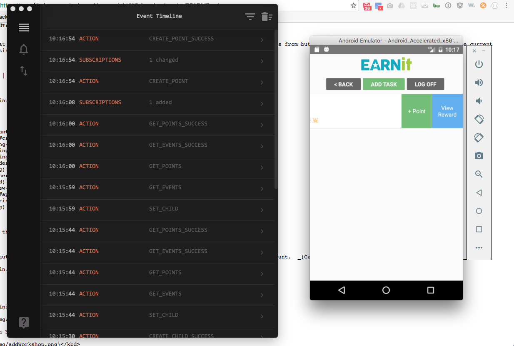

# EarnIt React-Native Client

EarnIt is an application that allows parents to track behavior and rewards for their children.

Front end component for the EarnIt App built with React-Native using Redux for state management.  All API calls to the [EarnIt C# backend](https://github.com/daynewright/EarnIt) are run through Redux-Sagas. Currently built as a native Android application.

## Technologies

React-Native | Redux | Redux-Saga

## Video Overview

You can watch a quick 5 minute video presentation of the application [here](https://youtu.be/s1SmGfkmU2Y).

## Table of Contents

- [Login / Register](#login--register)
- [View Children](#view-children)
- [Add Child](#add-child)
- [Add Task Button](#slide-view-task-button)
- [View Tasks](#view-tasks)
- [Add Reward Button](#slide-view-add-reward-button)
- [Add Reward](#add-reward)
- [Add Points](#slide-view-add-points)
- [Remove Child](#remove-child)

## Walkthrough

Below is a simple Walkthrough of the application showing state changes and actions.

The current flow of the application is as follows:

`EVENT/ACTION > ACTION CREATOR > MIDDLEWARE (REDUX-SAGA) > REDUCER > STORE UPDATE > COMPONENT RE-RENDER`

_On the left side you see [Reatotron](https://github.com/reactotron/reactotron) which shows the state and actions firing.  On the right you can see the different stages of the application UI._

### Login / Register

The first screen you are meet with allows you to register or login.  Both screens are the same design with the register requiring the password repeated.

<kbd></kbd>

### View Children

Once you login successfully, you will be shown all the children that have been added to the logged in account.

<kbd></kbd>

### Add Child

If you click `ADD CHILD` then you are met with this screen that allows you to add a new child record.

<kbd></kbd>

### Slide View Task Button

If you slide left then you are able to view `EARNED REWARDS` and `TASKS` for the selected child.  You  can also view the tasks by simply clicking on the child section.

<kbd></kbd>

### View Tasks

Once you navigate to the task view, you will see a list of tasks added for that child.  If none are added then it will notify you and prompt you to create one.  The message below the task will change based on if a reward has been created, if points have been given or if the total amount of points to earn the reward have been given.

<kbd></kbd>

### Slide View Add Reward button

If the current task you are viewing does not have a reward associated with it then you will get the button `ADD REWARD` when you slide left.

<kbd></kbd>

### Add Reward

If a task has no reward added then you will be instructed to slide left and click the `ADD REWARD` button.  You will be met with a form to add a reward for that task.

<kbd></kbd>

### Add Points

Once a task and reward has been added you can then slide left and click the `+ POINT` button to increment the point total for that task and reward.  Once the total amount of points is reached the task will be marked as earned.

<kbd></kbd>

### Remove Child

You also have the ability to delete children and tasks from the application in a similar fashion.  Simple slide right and you will be met with a `DELETE` button that will allow you to remove that record as well as all related records in tasks, rewards and points.

<kbd></kbd>
